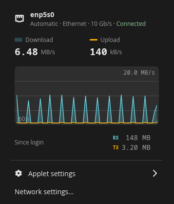
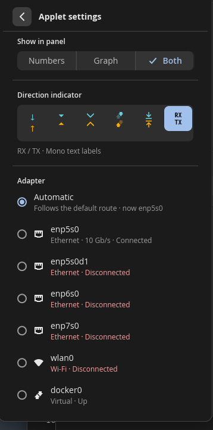
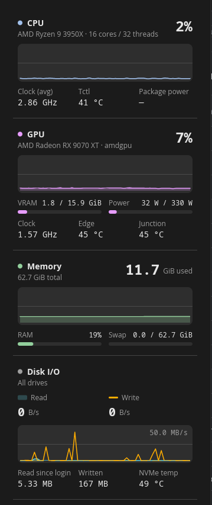
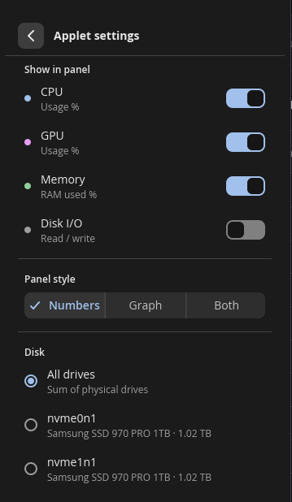

<div align="center">

<picture>
  <source media="(prefers-color-scheme: dark)" srcset="docs/logo-white.png">
  
</picture>

<br>

**Three tiny, native COSMIC panel applets: live network traffic; CPU, AMD GPU, memory and disk at a glance; and your Claude usage limits.**

Straight from procfs and sysfs. No system-stats crates, no daemon, no polling of anything you aren't looking at. One read pass a second, about 0.1 % of one core, and less memory than COSMIC's own clock.

[](https://www.rust-lang.org/)
[](https://system76.com/cosmic)
[](https://github.com/pop-os/libcosmic/commit/60ad2cc4c33d7500aba557cd9150e6938d72d5a1)
[](https://wayland.freedesktop.org/)
[](https://docs.kernel.org/gpu/amdgpu/)
[](LICENSE)


*An XS top panel: System Monitor on the left, Network Traffic on the right. Values stay centred and the width never moves.*

</div>

---

## ✨ What's in the box

| | Applet | What it shows |
| --- | --- | --- |
| 📶 | **Network Traffic** | Live download and upload for one adapter (numbers, sparkline, or both), with a 60 s graph and session totals in the popup. Follows the default route automatically. |
| 🖥️ | **System Monitor** | CPU, AMD GPU, RAM and disk I/O as labelled chunks in the panel; a detailed popup with clocks, temperatures, power, VRAM, swap and NVMe temps. |
| 🤖 | **AI Usage** | Claude's Session (5-hour), Weekly and Fable limits as small bars in the panel, with reset times and pace in the popup. Reuses Claude Code's login, read-only. |

They are separate applets, each with its own panel slot, settings and process. Add any combination.

---

## 🚀 Built light

| | Technology | Why it matters |
| --- | --- | --- |
| 🦀 | **Rust + libcosmic** | Native COSMIC applets in the same toolkit as the stock ones, pinned to libcosmic `60ad2cc`. They follow your theme, accent, density and roundness live. |
| 🎨 | **Software rendering** | Built on tiny-skia with no `wgpu`. There is no GPU context per applet, so no VRAM and no driver threads sit idle in the panel. |
| 📂 | **Direct procfs / sysfs** | No `sysinfo`, no helper daemon. Each source is read from the kernel file the spec names, with small stack-buffer reads and no allocation per value. |
| 🗂️ | **Paths resolved once** | hwmon labels, GPU sensors, drives and adapters are discovered at start and on a slow timer, never globbed per tick. |
| 👁️ | **Only what's on screen** | Clocks, VRAM, GPU power and NVMe temps are read only while the popup shows them. The panel needs about 8 small reads a second. |
| 💤 | **Never wakes a sleeping GPU** | A runtime-suspended dGPU reads as idle without touching its sensors, so laptops stay in D3cold. |
| 🧵 | **Single-thread executor** | One 1 Hz timer per applet. Rates come from monotonic `Instant` deltas, never an assumed second. |
| 🔒 | **No privileges, ever** | Nothing calls `sudo` or `pkexec` or writes to sysfs. Root-only counters show `—`. |

Measured on a Ryzen 9 3950X with an RX 9070 XT over 30 s on the live panel:

| | CPU | Memory (RSS) |
| --- | --- | --- |
| Network Traffic | ~0.1 % of one core | 25.0 MB |
| System Monitor | ~0.1 % of one core | 24.7 MB |
| AI Usage | ~0.1 % of one core (one request every 5 min) | 31.2 MB |
| *stock COSMIC clock applet* | – | 28.8 MB |

---

## 📶 Network Traffic

<div align="center">

&nbsp;&nbsp;

</div>

- 📊 **Three panel modes.** *Numbers*, *Graph* or *Both* (default): a sparkline beside two rate lines.
- 📐 **Rock-steady width.** Each line is three fixed cells (indicator | number | unit) in the mono font, so `0 B/s`, `9.84 kB/s`, `12.4 MB/s` and `—` take exactly the same space.
- 🧭 **Automatic adapter.** Follows the IPv4 default route (lowest metric), falls back to IPv6, then to the first physical interface that's up. It re-checks every 5 s, so switching from Ethernet to Wi-Fi follows within seconds.
- 🔌 **Any adapter, by name.** Physical first, then virtual (WireGuard, Tailscale, Docker…); `veth*` hides once there are more than three. A pinned USB adapter that's unplugged stays selected and resumes when it's back.
- 📈 **A graph that's honest.** One shared nice-number scale (1/2/5 × 10ⁿ), download as area plus line, upload as a line, newest on the right. No smoothing and no fake animation; a counter reset is a gap, not a spike.
- 🔄 **History survives switching.** Every interface is sampled, so the graph is already full when you switch adapters.
- 🧮 **Session totals.** Downloaded and uploaded since login, in decimal SI.
- 🚦 **States that say why.** *Cable unplugged*, *Interface down*, *Can't read counters*, *not found · using Automatic*.
- ⚙️ **Network settings…** opens COSMIC Settings → Network.

### Direction indicators

Six styles, picked live in *Applet settings*. Download is always `accent_blue` and upload `accent_orange`, taken from your theme's palette and never from your accent colour.

| | Style | Down / Up | Source |
| --- | --- | --- | --- |
| ⬇️ | **Arrows** | `↓` `↑` | Text glyphs |
| 🔻 | **Triangles** | `pan-down-symbolic` / `pan-up-symbolic` | COSMIC icon theme |
| ⌄ | **Chevrons** *(default)* | `go-down-symbolic` / `go-up-symbolic` | COSMIC icon theme |
| 📡 | **Receive / transmit** | `network-receive-symbolic` / `network-transmit-symbolic` | COSMIC icon theme; best on panel size M+ |
| ⤓ | **Arrow to bar** | `net-down-bar-symbolic` / `net-up-bar-symbolic` | Custom icons shipped with the applet |
| 🔤 | **RX / TX** | `RX` `TX` | Mono text labels |

---

## 🖥️ System Monitor

<div align="center">

&nbsp;&nbsp;

</div>

- 🧩 **Pick your metrics.** CPU, GPU, RAM, DISK, always in that order. At least one stays on.
- 🎛️ **Three panel styles.** *Numbers* (label over value), *Graph* (label over a 32×15 sparkline) or *Both*. A vertical dock stacks the chunks; a vertical XS dock switches to graphs.
- 🌡️ **Hot warnings with hysteresis.** Tctl ≥ 85 °C, GPU junction within 10 °C of its critical limit (or edge ≥ 85 °C) tints the value. It clears only after dropping 3 °C, so values never flicker.
- 🗒️ **Every reading has a source.** Each one comes from a named kernel file, and unknowns show `—` without moving the layout.

| | Section | Headline | Details | Source |
| --- | --- | --- | --- | --- |
| 🟦 | **CPU** | usage % | Clock (avg), Tctl, Package power | `/proc/stat`, `/proc/cpuinfo`, `cpufreq`, `k10temp` / `coretemp`, RAPL |
| 🟪 | **GPU** | busy % | VRAM and Power meters; Clock, Edge, Junction | `amdgpu` sysfs and hwmon; name from libdrm `amdgpu.ids`, then `pci.ids` |
| 🟩 | **Memory** | GiB used | RAM % and Swap meters | `/proc/meminfo` (used = total − available) |
| ⬜ | **Disk I/O** | Read and Write rates | Read since login, Written, NVMe temp | `/sys/block/*/stat`, NVMe hwmon |

- 🎮 **AMD GPUs, named properly.** Discovers every `amdgpu` card, defaults to the one with the most VRAM, and resolves the exact model from device and revision (e.g. *AMD Radeon RX 9070 XT*, not the whole family).
- 💽 **Physical drives only.** Loop, RAM, zram, device-mapper and md devices are skipped. Pick *All drives* (the sum) or one drive by model and size.
- 📜 **Scrolls on short screens.** Below 1000 logical px the sections scroll and *Applet settings* stays reachable.

### 🔋 Package power (optional)

CPU package power comes from the RAPL counter `/sys/class/powercap/intel-rapl:0/energy_uj` (AMD Zen too). Since CVE-2020-8694 it is **root-only**, so the applet shows `—` and never asks for privileges. To opt in on a machine where you accept that power side-channel:

```sh
sudo install -m644 crates/sysmon/resources/60-cosmic-applet-sysmon-rapl.rules /etc/udev/rules.d/
sudo udevadm trigger --subsystem-match=powercap
```

The applet picks it up within 30 s, with no restart. To undo it, delete the rule and reboot.

---

## 🤖 AI Usage

A robot, then one small bar per window: **5h** (Session), **Week** and **Fable**, in that order. Each bar fills with your accent colour, turns to the warning colour at 80 % and the destructive colour at 100 %, and carries a tick where even spending would put you. The popup lists each window with its percentage, reset time ("Resets in 2h 13m" or "Resets Sat 9:00 AM") and pace ("14% under pace").

- **Panel style:** Bars (default), Percent or Both; show **Used** or **Left**; optionally a **Reset** countdown for the 5-hour window. At 100 % the value reads `MAX` and the bar is solid, so the limit doesn't rely on colour.
- **Login:** it reads Claude Code's own login (`~/.claude/.credentials.json`, or `$CLAUDE_CONFIG_DIR`). It **never writes, refreshes or rotates it**; when the login expires, run `claude` once and the applet picks it up within seconds.
- **Network:** one `GET https://api.anthropic.com/api/oauth/usage` every 1, 5 or 15 minutes (±10 % jitter), on opening the popup if the data is over a minute old, and just after each window resets. It backs off while offline and honours `Retry-After`. No telemetry and no usage cache on disk.
- **Undocumented endpoint:** if its format changes, the popup says "Usage format not recognised" and **Copy diagnostics** copies the HTTP status and the JSON key names only, never values or the token.
- **States:** not signed in, login expired, offline, rate limited, format not recognised and no Fable limit each have their own banner or header text; stale values are dimmed.
- **Clock time** follows the COSMIC time applet's 12/24-hour setting.

`just demo` runs the popup in a window, cycling through every state every 10 s from the test fixtures, with no login and no network (`AI_USAGE_DEMO_SCENE=n` starts on scene *n*).

---

## 📦 Install

Needs Rust (edition 2024) and the usual COSMIC build dependencies (`libxkbcommon`, `wayland`, `pkg-config`).

```sh
git clone https://github.com/dc9090-web/yutani-sysmon
cd yutani-sysmon
just build
sudo just install           # → /usr/local
```

Then add **Network Traffic**, **System Monitor** and/or **AI Usage** in *Settings → Desktop → Panel → Applets*.

<details>
<summary>Installing without root</summary>

```sh
PREFIX=~/.local just install
```

cosmic-panel launches applets with the session `PATH`, which usually lacks `~/.local/bin`. Point the desktop entries at the binaries:

```sh
sed -i "s|^Exec=|Exec=$HOME/.local/bin/|" ~/.local/share/applications/io.github.dc.CosmicApplet{NetTraffic,SysMon,AiUsage}.desktop
```
</details>

| Recipe | Does |
| --- | --- |
| `just build` | `cargo build --release` |
| `just check` | clippy with `-D warnings`, and `cargo fmt --check` |
| `just test` | unit tests: formatting, parsers against fixture files, hysteresis, config invariants |
| `just install` / `just uninstall` | binaries, desktop entries and icons under `$PREFIX` |
| `just preview sysmon` | the popup in an ordinary window, no panel needed (`APPLET_PREVIEW=settings` opens the settings page) |
| `just run net-traffic` | run with debug logs |
| `just demo` | AI Usage's popup cycling through every state, without a login or network |

---

## ⚙️ Settings

Changes apply instantly and are saved by cosmic-config, with no Save button. External edits apply live too.

| Applet | Config | Keys |
| --- | --- | --- |
| Network Traffic | `~/.config/cosmic/io.github.dc.CosmicAppletNetTraffic/v1/` | `mode`, `indicator`, `adapter` |
| System Monitor | `~/.config/cosmic/io.github.dc.CosmicAppletSysMon/v1/` | `show_cpu`, `show_gpu`, `show_mem`, `show_disk`, `style`, `disk`, `gpu` |
| AI Usage | `~/.config/cosmic/io.github.dc.CosmicAppletAiUsage/v1/` | `show_session`, `show_weekly`, `show_fable`, `show_session_reset`, `style`, `amount`, `reset_format`, `refresh_minutes` |

---

## 🗺️ Layout

```text
crates/
  common/        shared: formatting, 60-slot rings, sysfs readers, graph canvas, theme inks, popup pieces
  net-traffic/   the Network Traffic applet  (cosmic-applet-net-traffic)
  sysmon/        the System Monitor applet   (cosmic-applet-sysmon)
  ai-usage/      the AI Usage applet         (cosmic-applet-ai-usage)
handoff/         the original design and spec packages (SPEC, DESIGN, ACCEPTANCE, prototype, screenshots)
docs/            README images
```

The App IDs `io.github.dc.CosmicAppletNetTraffic`, `io.github.dc.CosmicAppletSysMon` and `io.github.dc.CosmicAppletAiUsage` are placeholders and should be changed before publishing to a distro.

---

## 📄 Licence

GPL-3.0-or-later, like the stock COSMIC applets. Icons in `handoff/*/design/icons` come from [pop-os/cosmic-icons](https://github.com/pop-os/cosmic-icons) (CC BY-SA 4.0); the two `net-*-bar-symbolic` icons and the AI Usage robot are custom.

<div align="center"><sub>ユタニ重工 · Yutani system monitoring</sub></div>
