<div align="center">

<picture>
  <source media="(prefers-color-scheme: dark)" srcset="docs/logo-white.png">
  
</picture>

<br>

**Five tiny, native COSMIC panel applets: live network traffic; CPU, AMD GPU, memory and disk at a glance; your Claude usage limits; the weather for your cities; and a ProtonVPN WireGuard switch with a torrent-only kill switch.**

The system applets read straight from procfs and sysfs: no system-stats crates, no daemon, no polling of anything you aren't looking at, one read pass a second and less memory than COSMIC's own clock. AI Usage makes one small HTTPS request every few minutes using Claude Code's existing login, which it never modifies. Weather refreshes one city every 30 minutes with your own OpenWeather key, kept in the system keyring. Each applet costs about 0.1 % of one core.

[](https://www.rust-lang.org/)
[](https://system76.com/cosmic)
[](https://github.com/pop-os/libcosmic/commit/60ad2cc4c33d7500aba557cd9150e6938d72d5a1)
[](https://wayland.freedesktop.org/)
[](https://docs.kernel.org/gpu/amdgpu/)
[](https://docs.anthropic.com/en/docs/claude-code)
[](https://openweathermap.org/)
[](LICENSE)


*An S top panel: AI Usage (with the Cyborg · cyan icon), System Monitor and Network Traffic, left to right. Values stay centred and the width never moves.*

</div>

---

## ✨ What's in the box

| | Applet | What it shows |
| --- | --- | --- |
| 📶 | **Network Traffic** | Live download and upload for one adapter (numbers, sparkline, or both), with a 60 s graph and session totals in the popup. Follows the default route automatically. |
| 🖥️ | **System Monitor** | CPU, AMD GPU, RAM and disk I/O as labelled chunks in the panel; a detailed popup with clocks, temperatures, power, VRAM, swap and NVMe temps. |
| 🤖 | **AI Usage** | Claude's Session (5-hour), Weekly and Fable limits as small bars in the panel, with reset times and pace in the popup. Reuses Claude Code's login, read-only. |
| 🛡️ | **VPN** | Two ProtonVPN WireGuard switches: a tunnel only qBittorrent can use, with a kill switch by construction and the forwarded port set in qBittorrent, and a NetworkManager tunnel for everything else. |
| 🌤️ | **Weather** | The icon and temperature for one of up to 5 saved cities; a popup with current conditions, alerts, the next 24 hours, 7 days and details. OpenWeather, with your own key. |

They are separate applets, each with its own panel slot, settings and process. Add any combination.

---

## 🚀 Built light

| | Technology | Why it matters |
| --- | --- | --- |
| 🦀 | **Rust + libcosmic** | Native COSMIC applets in the same toolkit as the stock ones, pinned to libcosmic `60ad2cc`. They follow your theme, accent, density and roundness live. |
| 🎨 | **Software rendering** | Built on tiny-skia with no `wgpu`. There is no GPU context per applet, so no VRAM and no driver threads sit idle in the panel. |
| 📂 | **Direct procfs / sysfs** | No `sysinfo`, no helper daemon. Each source is read from the kernel file the spec names, with small stack-buffer reads and no allocation per value. |
| 🗂️ | **Paths resolved once** | hwmon labels, GPU sensors, drives and adapters are discovered at start and on a slow timer, never globbed per tick. |
| 👁️ | **Only what's on screen** | Clocks, VRAM, GPU power and NVMe temps are read only while the popup shows them. The panel needs about 8 small reads a second. |
| 💤 | **Never wakes a sleeping GPU** | A runtime-suspended dGPU reads as idle without touching its sensors, so laptops stay in D3cold. |
| 🧵 | **Single-thread executor** | One 1 Hz timer per system applet. Rates come from monotonic `Instant` deltas, never an assumed second. AI Usage sleeps until its next request and redraws its countdowns every 30 s. |
| 🌐 | **One host, no telemetry** | AI Usage talks only to `api.anthropic.com` over rustls, caches nothing on disk, and holds the token only for the length of a request. |
| 🗝️ | **Key in the keyring** | Weather keeps your OpenWeather key in the Secret Service keyring (a 0600 file only if there's none), never in config or logs, and talks only to `api.openweathermap.org`. |
| 🔑 | **Hands off your login** | AI Usage opens Claude Code's credentials read-only and never refreshes the token, so it can't log Claude Code out. |
| 🔒 | **No privileges, except one helper** | The applets never call `sudo` or `pkexec` or write to sysfs; root-only counters show `—`. The one exception is VPN's torrent tunnel: a small D-Bus-activated root helper, sandboxed by systemd and guarded by polkit, that only builds the namespace and starts qBittorrent in it. |

Measured on a Ryzen 9 3950X with an RX 9070 XT on the live panel (30 s for the system applets; 6 min, startup included, for AI Usage):

| | CPU | Memory (RSS) |
| --- | --- | --- |
| Network Traffic | ~0.1 % of one core | 25.0 MB |
| System Monitor | ~0.1 % of one core | 24.7 MB |
| AI Usage | ~0.1 % of one core (one request every 5 min) | 31.2 MB |
| Weather | idle between refreshes (one city every 30 min) | 32.7 MB |
| *stock COSMIC clock applet* | – | 28.8 MB |

---

## 📶 Network Traffic

<div align="center">

&nbsp;&nbsp;

</div>

- 📊 **Three panel modes.** *Numbers*, *Graph* or *Both* (default): a sparkline beside two rate lines.
- 📐 **Rock-steady width.** Each line is three fixed cells (indicator | number | unit) in the mono font, so `0 B/s`, `9.84 kB/s`, `12.4 MB/s` and `—` take exactly the same space.
- 🧭 **Automatic adapter.** Follows the IPv4 default route (lowest metric), falls back to IPv6, then to the first physical interface that's up. It re-checks every 5 s, so switching from Ethernet to Wi-Fi follows within seconds.
- 🔌 **Any adapter, by name.** Physical first, then virtual (WireGuard, Tailscale, Docker…); `veth*` hides once there are more than three. A pinned USB adapter that's unplugged stays selected and resumes when it's back.
- 📈 **A graph that's honest.** One shared nice-number scale (1/2/5 × 10ⁿ), download as area plus line, upload as a line, newest on the right. No smoothing and no fake animation; a counter reset is a gap, not a spike.
- 🔄 **History survives switching.** Every interface is sampled, so the graph is already full when you switch adapters.
- 🧮 **Session totals.** Downloaded and uploaded since login, in decimal SI.
- 🚦 **States that say why.** *Cable unplugged*, *Interface down*, *Can't read counters*, *not found · using Automatic*.
- ⚙️ **Network settings…** opens COSMIC Settings → Network.

### Direction indicators

Six styles, picked live in *Applet settings*. Download is always `accent_blue` and upload `accent_orange`, taken from your theme's palette and never from your accent colour.

| | Style | Down / Up | Source |
| --- | --- | --- | --- |
| ⬇️ | **Arrows** | `↓` `↑` | Text glyphs |
| 🔻 | **Triangles** | `pan-down-symbolic` / `pan-up-symbolic` | COSMIC icon theme |
| ⌄ | **Chevrons** *(default)* | `go-down-symbolic` / `go-up-symbolic` | COSMIC icon theme |
| 📡 | **Receive / transmit** | `network-receive-symbolic` / `network-transmit-symbolic` | COSMIC icon theme; best on panel size M+ |
| ⤓ | **Arrow to bar** | `net-down-bar-symbolic` / `net-up-bar-symbolic` | Custom icons shipped with the applet |
| 🔤 | **RX / TX** | `RX` `TX` | Mono text labels |

---

## 🖥️ System Monitor

<div align="center">

&nbsp;&nbsp;

</div>

- 🧩 **Pick your metrics.** CPU, GPU, RAM, DISK, always in that order. At least one stays on.
- 🎛️ **Three panel styles.** *Numbers* (label over value), *Graph* (label over a 32×15 sparkline) or *Both*. A vertical dock stacks the chunks; a vertical XS dock switches to graphs.
- 🌡️ **Hot warnings with hysteresis.** Tctl ≥ 85 °C, GPU junction within 10 °C of its critical limit (or edge ≥ 85 °C) tints the value. It clears only after dropping 3 °C, so values never flicker.
- 🗒️ **Every reading has a source.** Each one comes from a named kernel file, and unknowns show `—` without moving the layout.

| | Section | Headline | Details | Source |
| --- | --- | --- | --- | --- |
| 🟦 | **CPU** | usage % | Clock (avg), Tctl, Package power | `/proc/stat`, `/proc/cpuinfo`, `cpufreq`, `k10temp` / `coretemp`, RAPL |
| 🟪 | **GPU** | busy % | VRAM and Power meters; Clock, Edge, Junction | `amdgpu` sysfs and hwmon; name from libdrm `amdgpu.ids`, then `pci.ids` |
| 🟩 | **Memory** | GiB used | RAM % and Swap meters | `/proc/meminfo` (used = total − available) |
| ⬜ | **Disk I/O** | Read and Write rates | Read since login, Written, NVMe temp | `/sys/block/*/stat`, NVMe hwmon |

- 🎮 **AMD GPUs, named properly.** Discovers every `amdgpu` card, defaults to the one with the most VRAM, and resolves the exact model from device and revision (e.g. *AMD Radeon RX 9070 XT*, not the whole family).
- 💽 **Physical drives only.** Loop, RAM, zram, device-mapper and md devices are skipped. Pick *All drives* (the sum) or one drive by model and size.
- 📜 **Scrolls on short screens.** Below 1000 logical px the sections scroll and *Applet settings* stays reachable.

### 🔋 Package power (optional)

CPU package power comes from the RAPL counter `/sys/class/powercap/intel-rapl:0/energy_uj` (AMD Zen too). Since CVE-2020-8694 it is **root-only**, so the applet shows `—` and never asks for privileges. To opt in on a machine where you accept that power side-channel:

```sh
sudo install -m644 crates/sysmon/resources/60-cosmic-applet-sysmon-rapl.rules /etc/udev/rules.d/
sudo udevadm trigger --subsystem-match=powercap
```

The applet picks it up within 30 s, with no restart. To undo it, delete the rule and reboot.

---

## 🤖 AI Usage

<div align="center">
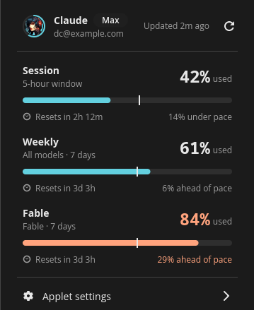
&nbsp;&nbsp;
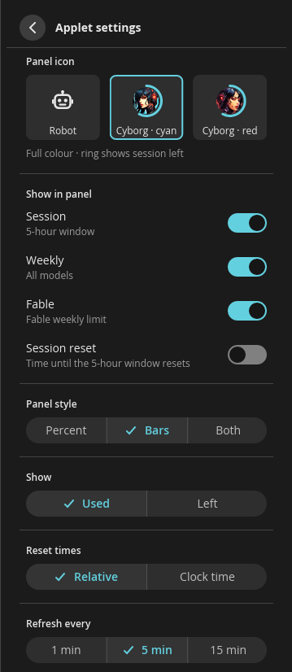
</div>

<div align="center">
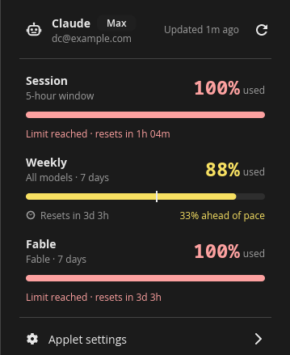
&nbsp;&nbsp;
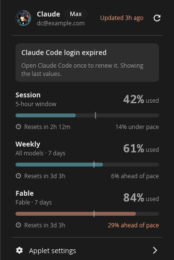
</div>

*Screenshots use the demo data (`just demo`), not a real account.*

An icon, then one small bar per window: **5h** (Session), **Week** and **Fable**, in that order. Each bar fills with your accent colour, turns to the warning colour at 80 % and the destructive colour at 100 %, and carries a tick where even spending would put you. The popup lists each window with its percentage, reset time ("Resets in 2h 13m" or "Resets Sat 9:00 AM") and pace ("14% under pace").

- 🤖 **Panel icon:** the symbolic **Robot** (default), or a full-colour **Cyborg** avatar (cyan or red) wrapped in a **session ring**: a fuel gauge of the 5-hour window's % *left*, drawn from 12 o'clock, accent → warning at 80 % used, and a full destructive ring at the limit. The ring ignores the Used/Left setting and dims when data is stale. Avatars need panel size S or larger; at XS the Robot shows.
- 🎚️ **Panel style:** Bars (default), Percent or Both; show **Used** or **Left**; optionally a **Reset** countdown for the 5-hour window. At 100 % the value reads `MAX` and the bar is solid, so the limit doesn't rely on colour.
- 🔑 **Login:** it reads Claude Code's own login (`~/.claude/.credentials.json`, or `$CLAUDE_CONFIG_DIR`). It **never writes, refreshes or rotates it**; when the login expires, run `claude` once and the applet picks it up within seconds.
- 🌐 **Network:** one `GET https://api.anthropic.com/api/oauth/usage` every 1, 5 or 15 minutes (±10 % jitter), on opening the popup if the data is over a minute old, and just after each window resets. It backs off while offline and honours `Retry-After`. No telemetry and no usage cache on disk.
- 🧪 **Undocumented endpoint:** if its format changes, the popup says "Usage format not recognised" and **Copy diagnostics** copies the HTTP status and the JSON key names only, never values or the token.
- 🚦 **States:** not signed in, login expired, offline, rate limited, format not recognised and no Fable limit each have their own banner or header text; stale values are dimmed.
- 🕒 **Clock time** follows the COSMIC time applet's 12/24-hour setting.

`just demo` runs the popup in a window, cycling through every state every 10 s from the test fixtures, with no login and no network (`AI_USAGE_DEMO_SCENE=n` starts on scene *n*; `AI_USAGE_DEMO_ICON=cyan|red` shows an avatar without saving it; `AI_USAGE_SHOT=file.pam` saves the window and exits, which is how the screenshots above were made).

---

## 🌤️ Weather

<div align="center">
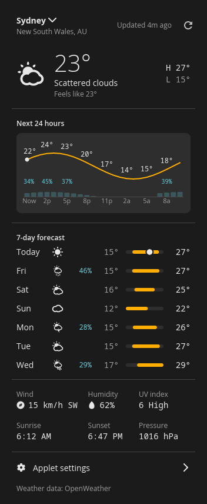
&nbsp;&nbsp;
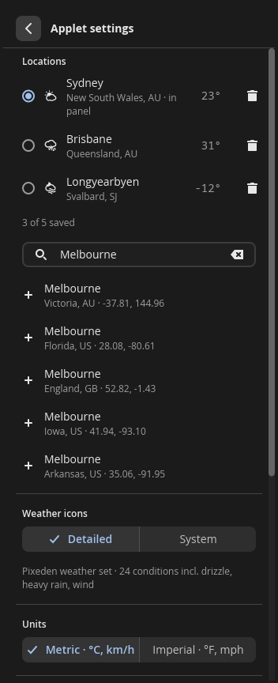
</div>

<div align="center">
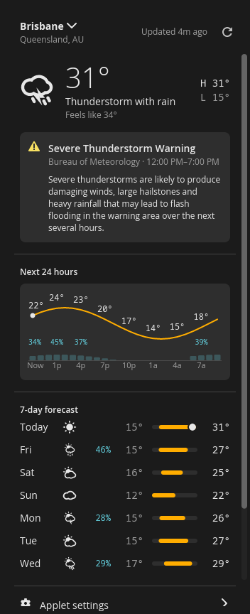
&nbsp;&nbsp;
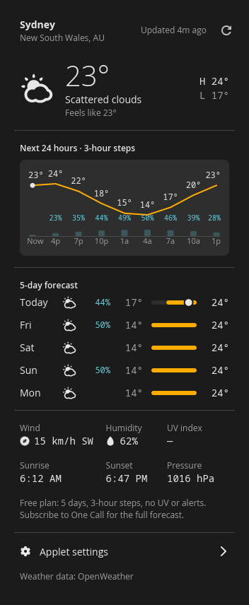
</div>

*Screenshots use the demo data (`just weather-demo`), not a live call.*

The condition icon and the temperature for your panel city, in a fixed 4-character field so the width never moves. Optionally the city name above it and today's high and low beside it; a warning dot on the icon during a weather alert. The popup shows current conditions, alert banners, a 24-hour temperature line with rain chances, the daily forecast on one week-wide scale, and wind, humidity, UV, sunrise, sunset and pressure.

- 🔑 **Your own key:** create one at openweathermap.org → *API keys* and paste it into *Applet settings*; **Test** saves it to the keyring and checks it. New keys can take up to 2 hours to activate.
- 📡 **Two plans:** with the **One Call by Call** subscription (One Call API 4.0) you get hourly steps, 7 days, UV and alerts. A plain free key works too, with 3-hour steps, 5 days, and no UV or alerts. The applet detects which you have.
- 💸 **Never charged:** One Call includes 1,000 free calls a day. A refresh costs 4 calls, so the 30-minute default uses about 200. The applet stops scheduled refreshes at 900 calls a UTC day. **Set your OpenWeather billing daily limit to 1,000** as well, so the account can never be charged.
- 🏙️ **Up to 5 cities:** search by name; the radio picks the panel city. Only the panel city refreshes on schedule (15, 30 or 60 min, ±10 % jitter). The others refresh when you look at them, and the city you're viewing refreshes when the popup opens on data over 10 minutes old.
- 🕒 **Local time everywhere:** hours, days, sunrise and sunset use the city's own time zone, not this machine's, and follow the COSMIC time applet's 12/24-hour setting.
- 🎨 **Two icon sets, never mixed:** **Detailed** (24 conditions, including drizzle, heavy rain and wind, built into the binary) or **System** (COSMIC's own `weather-*` icons).
- 💾 **Cache:** the last forecast per city is kept in `~/.cache/io.github.dc.CosmicAppletWeather/`, weather data only, and shown at startup with its age. Data over 12 hours old is discarded.
- 🚦 **States:** no key, key not accepted, no locations, free plan, offline (dimmed, with the age), rate limited (with a countdown), daily limit reached, and polar day or night (`—` for sunrise and sunset).
- ⚖️ **Attribution:** "Weather data: OpenWeather" is always on the popup, as OpenWeather requires.

`just weather-demo` runs the popup in a window, cycling through every state every 10 s from the test fixtures, with no key and no network (`WEATHER_DEMO_SCENE=n` starts on scene *n*; `WEATHER_SHOT=file.pam` saves the window and exits). `just live-check` makes one real call per endpoint with your stored key and lists any fields that differ from the fixtures (never values).

---

## 🛡️ VPN (ProtonVPN · WireGuard)

<div align="center">
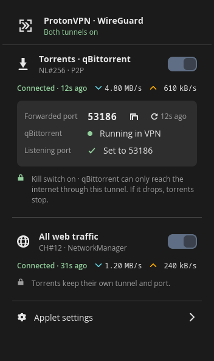
&nbsp;&nbsp;
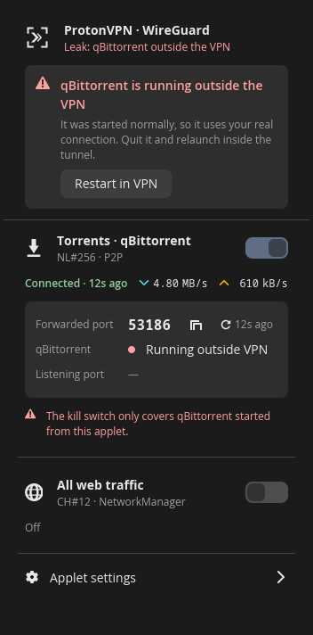
</div>

<div align="center">
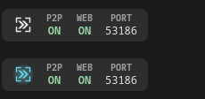
</div>

*Screenshots use the demo data (`just vpn-demo`).*

Two independent switches, each backed by its own Proton WireGuard `.conf`:

- 🧲 **Torrents · qBittorrent:** a root helper builds a network namespace whose only interfaces are `lo` and the WireGuard tunnel, and starts qBittorrent inside it. That's the kill switch: if the tunnel drops, torrents stop, and nothing in the namespace can fall back to your real connection. Proton's NAT-PMP port forwarding is renewed every 45 s and set as qBittorrent's listening port (in its config before launch, then live through its Web UI). DNS inside goes only to Proton's resolver.
- 🌐 **All web traffic:** a NetworkManager WireGuard connection, imported once, with IPv6 routed into the tunnel so it can't leak around it. NetworkManager stays the source of truth, so toggling it in COSMIC Settings works too.
- 🔀 **Both at once:** the torrent tunnel's encrypted packets carry a firewall mark that routes them past the web tunnel, so torrents keep their own exit and port.
- 🚨 **Leak detection:** a qBittorrent started any other way is spotted within 10 s (red dot and a banner); **Restart in VPN** moves it inside. Only qBittorrent started from the applet is protected, and other torrent clients aren't detected.
- 🎯 **Panel:** the reticle (first chevron = torrents, second = web), `P2P` / `WEB` / `PORT` chunks that never change width, and an amber or red dot when something needs attention. **Mono** or **Neon** icon style.
- 🔐 **Secrets:** private keys are parsed only to validate them, then go to the root helper (stored 0600 in `/etc/cosmic-vpn/`) or to NetworkManager. They are never logged, shown or kept in config. The qBittorrent Web UI password lives in the keyring.

**Setup:** download two configs from account.protonvpn.com → Downloads → WireGuard (one **P2P** server with **NAT-PMP on** and **Moderate NAT off** for torrents, any server for web). In qBittorrent, enable the Web UI on port 8080 and turn off its own UPnP/NAT-PMP. Then:

```sh
just vpn-check-conf ~/Downloads/*.conf   # what the parser sees; the key is never printed
just vpn-helper-install                  # the root helper, D-Bus, systemd and polkit files (sudo)
```

and import both configs from the applet's settings. Importing the torrent config asks for your admin password once; switching tunnels doesn't. `just vpn-helper-uninstall` removes the helper and any tunnel left up.

- 📦 **Native or Flatpak qBittorrent** both work; the applet finds `qbittorrent` on `PATH`, else `org.qbittorrent.qBittorrent`, or uses the command you set.
- ✅ **`sudo crates/vpn-helper/acceptance.sh`** checks a running torrent tunnel: its exit IPs against the host's, that the namespace has no way out but the tunnel, the conf file's permissions, and the kill switch (it blackholes the endpoint for 15 s, then restores it).

---

## 📦 Install

Needs Rust (edition 2024) and the usual COSMIC build dependencies (`libxkbcommon`, `wayland`, `pkg-config`).

```sh
git clone https://github.com/dc9090-web/yutani-sysmon
cd yutani-sysmon
just build
sudo just install           # → /usr/local
```

Then add **Network Traffic**, **System Monitor**, **AI Usage**, **Weather** and/or **VPN** in *Settings → Desktop → Panel → Applets*.

<details>
<summary>Installing without root</summary>

```sh
PREFIX=~/.local just install
```

cosmic-panel launches applets with the session `PATH`, which usually lacks `~/.local/bin`. Point the desktop entries at the binaries:

```sh
sed -i "s|^Exec=|Exec=$HOME/.local/bin/|" ~/.local/share/applications/io.github.dc.CosmicApplet{NetTraffic,SysMon,AiUsage,Weather,Vpn}.desktop
```
</details>

| Recipe | Does |
| --- | --- |
| `just build` | `cargo build --release` |
| `just check` | clippy with `-D warnings`, and `cargo fmt --check` |
| `just test` | unit tests: formatting, parsers against fixture files, hysteresis, config invariants, AI Usage's login and usage fixtures and refresh timing, Weather's parsers, icon mapping, free-plan aggregation and call budget |
| `just install` / `just uninstall` | binaries, desktop entries and icons under `$PREFIX` (Weather installs no icon files) |
| `just preview sysmon` | the popup in an ordinary window, no panel needed (`APPLET_PREVIEW=settings` opens the settings page) |
| `just run net-traffic` | run with debug logs |
| `just demo` | AI Usage's popup cycling through every state, without a login or network |
| `just weather-demo` | the same for Weather, without a key or network |
| `just live-check` | Weather: one real call per OpenWeather endpoint, compared with the fixtures |
| `just vpn-demo` | VPN's popup cycling through every state, with a fake helper and NetworkManager |
| `just vpn-check-conf <files>` | VPN: what the parser makes of your Proton configs, key never shown |
| `just vpn-helper-install` / `vpn-helper-uninstall` | VPN's root helper and its system files (sudo) |

---

## ⚙️ Settings

Changes apply instantly and are saved by cosmic-config, with no Save button. External edits apply live too.

| Applet | Config | Keys |
| --- | --- | --- |
| Network Traffic | `~/.config/cosmic/io.github.dc.CosmicAppletNetTraffic/v1/` | `mode`, `indicator`, `adapter` |
| System Monitor | `~/.config/cosmic/io.github.dc.CosmicAppletSysMon/v1/` | `show_cpu`, `show_gpu`, `show_mem`, `show_disk`, `style`, `disk`, `gpu` |
| AI Usage | `~/.config/cosmic/io.github.dc.CosmicAppletAiUsage/v1/` | `icon`, `show_session`, `show_weekly`, `show_fable`, `show_session_reset`, `style`, `amount`, `reset_format`, `refresh_minutes` |
| VPN | `~/.config/cosmic/io.github.dc.CosmicAppletVpn/v1/` | `p2p_conf`, `web_conf`, `web_nm_uuid`, `launch_qbit`, `quit_qbit`, `auto_port`, `webui_port`, `webui_user`, `show_port`, `restore`, `last_p2p`, `last_web`, `qbit_command`, `icon_style` (no keys or passwords) |
| Weather | `~/.config/cosmic/io.github.dc.CosmicAppletWeather/v1/` | `locations`, `panel_location`, `units`, `icon_set`, `show_city`, `show_hilo`, `refresh_minutes` (the API key is in the keyring, never here) |

---

## 🗺️ Layout

```text
crates/
  common/        shared: formatting, 60-slot rings, sysfs readers, graph canvas, theme inks, popup pieces
  net-traffic/   the Network Traffic applet  (cosmic-applet-net-traffic)
  sysmon/        the System Monitor applet   (cosmic-applet-sysmon)
  ai-usage/      the AI Usage applet         (cosmic-applet-ai-usage)
  weather/       the Weather applet          (cosmic-applet-weather)
  vpn/           the VPN applet              (cosmic-applet-vpn)
  vpn-helper/    its root helper             (cosmic-vpn-helper) and system files
  vpn-common/    shared: Proton conf parser, NAT-PMP codec, status types
handoff/         the original design and spec packages (SPEC, DESIGN, ACCEPTANCE, prototype, screenshots)
docs/            README images
```

The App IDs `io.github.dc.CosmicAppletNetTraffic`, `io.github.dc.CosmicAppletSysMon`, `io.github.dc.CosmicAppletAiUsage`, `io.github.dc.CosmicAppletWeather`, `io.github.dc.CosmicAppletVpn` and `io.github.dc.CosmicVpnHelper` are placeholders and should be changed before publishing to a distro.

---

## 📄 Licence

GPL-3.0-or-later, like the stock COSMIC applets. Icons in `handoff/*/design/icons` come from [pop-os/cosmic-icons](https://github.com/pop-os/cosmic-icons) (CC BY-SA 4.0); the two `net-*-bar-symbolic` icons and the AI Usage robot are custom. The two AI Usage Cyborg avatars are cropped from illustrations supplied by the project owner, who holds the rights to distribute them here. Weather's Detailed icons are converted from the Pixeden "Weather App Icons" pack (`crates/weather/resources/icons/weather/LICENSE-PIXEDEN.txt`), included with Pixeden's permission and built into the binary rather than installed as files.

<div align="center"><sub>ユタニ重工 · Yutani system monitoring</sub></div>
